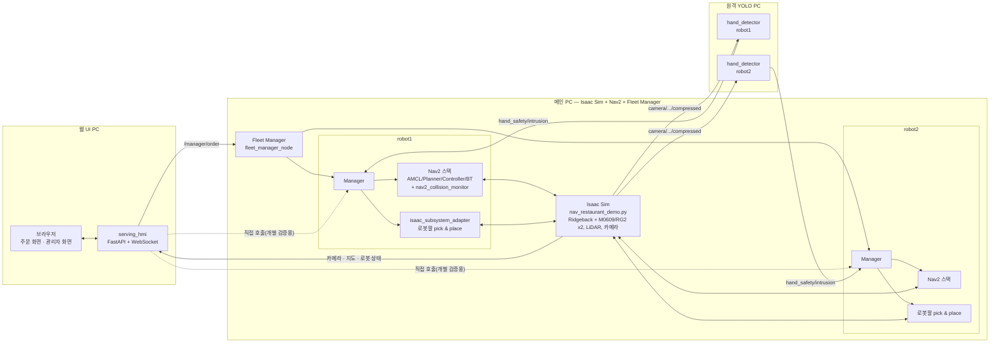
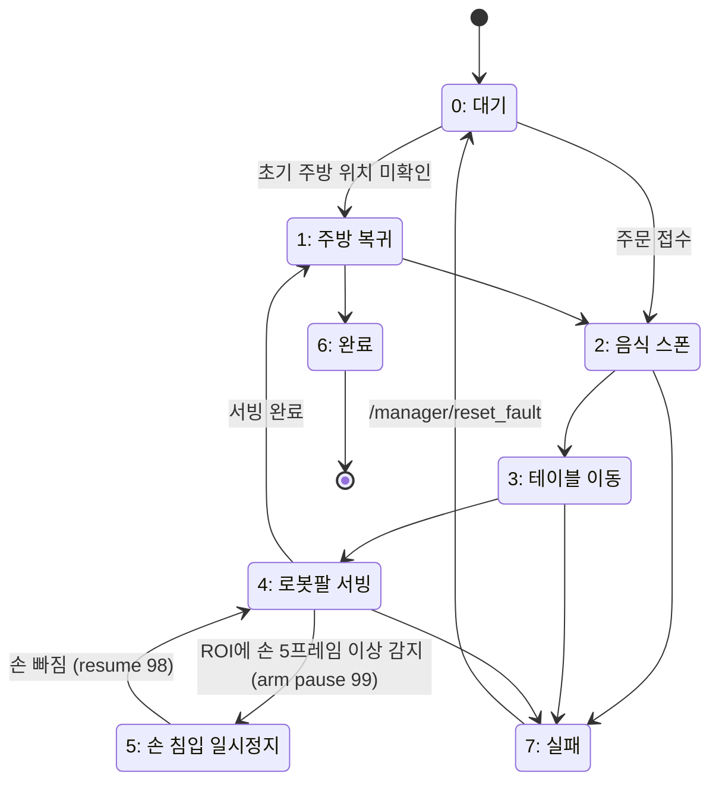

# Rokey_Co3_A1 서빙 로봇 및 손 안전 작업공간

## 주요 기능

- **멀티로봇 서빙**: Isaac Sim 위에서 서빙 로봇 2대(`robot1`, `robot2`)를 동시에 운용합니다.
  Fleet Manager가 들어온 주문을 대기 상태인 로봇에 자동 배정하므로, 한 로봇이
  주행 중이어도 다음 주문이 다른 로봇으로 넘어가 병렬로 처리됩니다.

- **자율주행 (Nav2)**: 로봇마다 네임스페이스가 분리된 Nav2 스택(AMCL, planner,
  controller, bt_navigator)을 실행하고, `nav2_collision_monitor`로 사람 또는
  장애물이 감지되면 정지/감속하는 안전 영역을 적용해 주방과 테이블 사이를
  도킹 오차 이내로 왕복합니다.

- **로봇팔 pick & place 서빙**: 피자, 음료, 식기, 접시 랙을 로봇별 payload
  경로(`/World/RobotPayloads/robotN/...`) 아래에서 스폰하고, 로봇팔이 집어
  테이블에 놓은 뒤 완료 상태를 `/World/Delivered/robotN`으로 옮깁니다. 로봇
  간 payload와 대상 물체가 서로 섞이지 않도록 격리됩니다.

- **손 안전 감지 (Hand Safety)**: 카메라 영상을 YOLO로 분석해 ROI 안에 손이
  들어오면 서빙 중인 로봇팔을 일시정지시키고, 손이 빠지면 자동으로 재개합니다.
  연산량이 큰 YOLO 추론은 별도 GPU 컴퓨터에서 돌리고 JPEG로 압축한 카메라
  스트림만 네트워크로 주고받아 대역폭을 아낍니다.

- **HMI 웹 대시보드**: 브라우저에서 테이블별 주문을 넣는 주문 화면과, 카메라·
  지도·로봇 상태를 확인하고 사람 스폰/제거·타이핑(손 침입 시험) 버튼으로
  테스트 시나리오를 재현할 수 있는 관리자 화면을 제공합니다.

- **로봇 간 경로 충돌 방지**: 같은 테이블을 상대 로봇이 이미 점유·접근 중이면
  대기하고, 식당 중앙 통로 반대편 aisle을 상대 로봇이 먼저 쓰고 있으면 비울
  때까지 대기합니다. 그 외에는 두 로봇이 서로 다른 테이블·통로를 동시에
  자유롭게 주행합니다.

- **SLAM 지도 생성**: 별도 브리지 없이 Isaac이 이미 발행 중인 `/scan`,
  `/odom`, TF를 그대로 재사용하는 원샷 `slam_toolbox` 매핑 모드로 새 지도를
  뽑아 `nav_robot5`의 경로 설정에 반영할 수 있습니다.

## 시스템 설계 및 플로우차트

### 시스템 아키텍처 (PC 3대 + 로봇 2대)



### 주문 처리 플로우 (로봇 1대 기준 `system/status`)



Fleet Manager는 유휴 상태(`0` 또는 `6`)인 로봇 중 `robot1`을 우선 배정하고,
`robot1`이 주행 중이면 다음 주문을 `robot2`에 배정합니다. 손 안전 토픽이
서빙 중 2초 이상 끊기면 fail-safe로 상태 `7`이 됩니다.

## 운영체제 및 환경

### OS / 미들웨어 / 시뮬레이터 / 언어

| 구분 | 내용 |
| --- | --- |
| 운영체제 | Ubuntu 22.04 LTS (Jammy Jellyfish) |
| 미들웨어 | ROS 2 Humble Hawksbill (`ros-humble-ros-base`), DDS는 기본값인 Fast DDS(`rmw_fastrtps_cpp`) 사용 |
| 시뮬레이터 | NVIDIA Isaac Sim 5.1.0 (`5.1.0-rc.19`), Isaac ROS 2 Bridge(humble) |
| 언어 | Python 3.10 (ROS 2 노드, YOLO 추론, Isaac 스크립트), JavaScript/HTML/CSS (HMI 프론트엔드) |

### 주요 라이브러리

- **Nav2**: `nav2_bringup`, `nav2_collision_monitor`, AMCL, planner/controller/bt_navigator
- **slam_toolbox**: SLAM 지도 생성
- **ultralytics YOLO** (YOLOv10n 손 검출 모델) + **PyTorch(CUDA)**: 손 안전 감지 추론
- **OpenCV / cv_bridge**: 이미지 처리 및 ROS ↔ OpenCV 변환
- **FastAPI + uvicorn**: HMI 백엔드 웹서버 및 WebSocket 스트리밍
- **tf2_ros**: 좌표 변환(odom → base_link 등)

라이브러리 버전은 저장소에 `requirements.txt`로 고정되어 있지 않으므로, 실제
설치된 버전은 각 장비에서 `pip show <패키지명>`으로 확인하십시오.

### 사용 장비

| 구분 | 사양 |
| --- | --- |
| 메인 PC (Isaac Sim / Manager) | MSI Vector 16 HX AI A2XWIG-U9 QHD+ · CPU: 인텔 Ultra 9 275HX (Intel AI Boost NPU) · GPU: 엔비디아 지포스 RTX 5080 Laptop GPU (16GB GDDR7, 1,334 AI TOPS) · RAM: 64GB |
| 원격 YOLO 컴퓨터 | 별도 GPU 탑재 컴퓨터 (CUDA 지원 PyTorch 필요, 상세 사양 미기재) |

### Isaac Sim 로봇 구성요소

| 구성요소 | 유형 | 토픽 / 스펙 |
| --- | --- | --- |
| 모바일 베이스 | Ridgeback 구동 베이스 | `cmd_vel_safe` 구독 후 주행, `/robotN/nav_robot/odom` 기준 위치 추종 |
| 로봇팔 | M0609 6축 협동로봇 + RG2 그리퍼 | RMPflow 기반 pick & place, `/robotN/arm/command`, `/robotN/arm/status` |
| LiDAR | 2D LiDAR 시뮬레이션 (RPLIDAR S2E 모델) | `/robotN/scan` (`sensor_msgs/LaserScan`), 범위 0.20–12.0 m, 180 샘플, 10 Hz |
| RGB 카메라 | Intel RealSense D455 (깊이 옵션, 기본 비활성) | `/robotN/camera/color/image_raw`, 압축본 `.../compressed`(JPEG q90), 1280×960, 약 15 Hz |
| Odometry | 휠 오도메트리 | `/robotN/nav_robot/odom`, `/robotN/two_wheel/odom_raw` (`nav_msgs/Odometry`) |

## 의존성 설치

컴퓨터 3대로 역할을 나눠 실행합니다: **메인 PC**(Isaac Sim 시뮬레이션, Nav2
자율주행, Fleet Manager 주문 배정, 로봇팔 pick & place 제어, 경로 충돌 관측,
SLAM 지도 생성), **원격 YOLO PC**(손 안전 감지), **웹 UI PC**(HMI 대시보드).
공통으로 세 PC 모두 Ubuntu 22.04 + ROS 2 Humble이 설치되어 있어야 합니다.

저장소에는 `hand_safety`가 두 위치에 있습니다. `src/hand_safety`는
`COLCON_IGNORE`가 포함된 이전 복사본이므로 빌드 대상에서 제외되고, 루트의
`hand_safety`만 실제로 빌드됩니다.

### 메인 PC (Isaac Sim + Nav2 + Fleet Manager)

- NVIDIA Isaac Sim 5.1.0 설치 및 GPU 드라이버. 설치 경로가 기본값
  (`~/dev_ws/isaac_sim/isaacsim/_build/linux-x86_64/release`)과 다르면
  `ISAAC_SIM_ROOT` 환경변수로 지정하십시오.
- 주방 3D 에셋: 식당 씬(`nav_robot/assets/lightweight_restaurant/`)은 git에
  포함되어 있지만, 이 씬이 참조하는 주방 모델
  `assets/Lightwheel_Kitchen/Collected_KitchenRoom/KitchenRoom.usd`는 용량
  때문에 `.gitignore`로 제외되어 있어 클론 직후에는 없습니다. 다운로드 방법은
  [nav_robot5/assets/Lightwheel_Kitchen/README.md](nav_robot5/assets/Lightwheel_Kitchen/README.md)를
  참고해 압축을 풀고 `assets/Lightwheel_Kitchen/Collected_KitchenRoom/`
  아래에 두십시오. 다른 폴더(`nav_robot`, `serving_robot`)에 이미 받아둔
  사본이 있으면 `nav_robot5/tools/sync_restaurant_assets.sh`로 복사할 수
  있습니다. 없는 상태로 Isaac Sim을 실행하면 주방 부분이 깨진 참조로
  표시됩니다. `.gitignore`의 `assets/nvidia_restaurant/`,
  `assets/kenney_furniture/`는 현재 `tools/` 실행 경로에서 쓰이지 않는
  구버전 프로토타입 스크립트(`serving_robot/isaacpjt/` 아래) 전용이라
  일반 실행에는 준비할 필요가 없습니다.
- ROS 2 Humble Desktop (`rviz2` 포함)
- apt(rosdep): `ros-humble-nav2-bringup`, `ros-humble-nav2-collision-monitor`,
  `ros-humble-nav2-lifecycle-manager`, `ros-humble-nav2-simple-commander`,
  `ros-humble-robot-state-publisher`, `ros-humble-rviz2`,
  `ros-humble-cv-bridge`, `python3-opencv`
  - 지도를 새로 뜰 계획이면 추가: `ros-humble-slam-toolbox`,
    `ros-humble-nav2-map-server`
- colcon 빌드 대상: `serving_robot_interfaces`, `serving_robot_manager`,
  `two_wheel_rails`, `hand_safety`(로컬 진단용 빌드만, 기본은 원격 YOLO 사용)
- Isaac Sim 내장 `python.sh`를 사용하므로 시뮬레이션 스크립트용 별도 pip
  설치는 필요 없습니다.

```bash
cd <워크스페이스 경로>
source /opt/ros/humble/setup.bash
PYTHONNOUSERSITE=1 ./tools/colcon_safe.py build \
  --symlink-install \
  --packages-up-to serving_robot_interfaces serving_robot_manager two_wheel_rails hand_safety \
  --executor sequential \
  --event-handlers console_start_end+ desktop_notification- status- terminal_title-
source install/setup.bash
```

### 원격 YOLO PC (손 안전 감지 전용)

- NVIDIA GPU 드라이버 + CUDA (torch GPU 빌드용)
- ROS 2 Humble Base (Isaac Sim, GUI 불필요)
- apt(rosdep): `ros-humble-cv-bridge`, `python3-opencv`,
  `ros-humble-ament-index-python`
- pip: `torch`(CUDA 지원 빌드), `ultralytics`
- colcon 빌드 대상: `hand_safety`, `serving_robot_manager`(원격 손 감지 launch
  파일이 이 패키지에 있어 함께 빌드해야 함)

```bash
cd <워크스페이스 경로>
source /opt/ros/humble/setup.bash
PYTHONNOUSERSITE=1 ./tools/colcon_safe.py build \
  --symlink-install \
  --packages-up-to hand_safety serving_robot_manager \
  --executor sequential \
  --event-handlers console_start_end+ desktop_notification- status- terminal_title-
source install/setup.bash
```

### 웹 UI PC (HMI 대시보드)

- ROS 2 Humble Base (Isaac Sim, GPU 불필요)
- pip: `fastapi`, `uvicorn`
- colcon 빌드 대상: `serving_robot_interfaces`, `serving_hmi`
- 브라우저로 `http://localhost:8000` 접속 (주문 화면), `/admin`(관리자 화면)

```bash
cd <워크스페이스 경로>
source /opt/ros/humble/setup.bash
PYTHONNOUSERSITE=1 ./tools/colcon_safe.py build \
  --symlink-install \
  --packages-up-to serving_robot_interfaces serving_hmi \
  --executor sequential \
  --event-handlers console_start_end+ desktop_notification- status- terminal_title-
source install/setup.bash
```

라이브러리 버전은 저장소에 `requirements.txt`로 고정되어 있지 않으므로, 실제
설치된 버전은 각 PC에서 `pip show <패키지명>`으로 확인하십시오.

## 실행 순서

세 PC를 아래 순서로 하나씩 띄웁니다. `<워크스페이스 경로>`는 이 저장소를
클론한 디렉터리(= colcon 빌드 결과인 `build/`, `install/`, `log/`가 생기는
루트)이며, PC마다 실제 경로로 바꿔서 사용하십시오. 각 단계는 이전 단계가
준비된 뒤에 시작해야 합니다. 현재 내부망은 메인 Isaac/Manager 컴퓨터
`10.10.0.1`, 원격 YOLO 컴퓨터 `10.10.0.2`이며, 모든 ROS 터미널은 같은
`ROS_DOMAIN_ID=101`, `ROS_LOCALHOST_ONLY=0`을 사용하고, Isaac 터미널에는
`/opt/ros/humble/setup.bash`를 source하지 않습니다.

### 1. 메인 PC — ① Isaac Sim

```bash
cd <워크스페이스 경로>
export ROS_DOMAIN_ID=101
export ROS_LOCALHOST_ONLY=0
./tools/run_multi_integrated_isaac.sh
```

식당과 `/World/NavRobot1`, `/World/NavRobot2`가 모두 로드되고 시뮬레이션이
재생 중인지 확인한 뒤 다음 단계로 넘어갑니다.

### 2. 메인 PC — ② Nav2 + Fleet Manager

```bash
cd <워크스페이스 경로>
source /opt/ros/humble/setup.bash
source install/setup.bash
export ROS_DOMAIN_ID=101
export ROS_LOCALHOST_ONLY=0
./tools/t2_ros.sh
```

이 launch는 각 로봇의 로컬 raw 카메라를 JPEG 품질 90으로 압축해
`/robot*/camera/color/image_raw/compressed`로 발행합니다. 원격 구독자가
연결되기 전에는 JPEG 인코딩을 수행하지 않습니다. 인자를 생략하면 아래
기본값으로 실행됩니다.

```text
enable_serving_workers:=true
navigation_only:=false
serialize_shared_payloads:=false
enable_local_hand_detection:=false
enable_jpeg_transport:=true
jpeg_quality:=90
use_sim_time:=true
```

`robot1`, `robot2` 모두 `Navigation is fully initialized and ready!`를
출력할 때까지 주문을 넣지 않습니다.

### 3. 원격 YOLO PC — ③ YOLO

```bash
cd <워크스페이스 경로>
export ROS_DOMAIN_ID=101
export ROS_LOCALHOST_ONLY=0
./tools/run_remote_yolo.sh
```

메인 PC와 같은 유선 LAN, 같은 `ROS_DOMAIN_ID`, `ROS_LOCALHOST_ONLY=0`이
필요합니다.

### 4. 웹 UI PC — ④ HMI

```bash
cd <워크스페이스 경로>
source /opt/ros/humble/setup.bash
source install/setup.bash
export ROS_DOMAIN_ID=101
export ROS_LOCALHOST_ONLY=0
./tools/t3_hmi.sh
```

HMI는 두 로봇의 `/robot*/camera/color/image_raw/compressed`만 구독하며
JPEG를 재인코딩하지 않고 브라우저로 그대로 전달합니다.

브라우저에서 주문 화면 `http://localhost:8000`, 관리자·테스트 화면
`http://localhost:8000/admin`을 엽니다.

### 5. (선택) 메인 PC — ⑤ 연결 확인

```bash
cd <워크스페이스 경로>
source /opt/ros/humble/setup.bash
source install/setup.bash
export ROS_DOMAIN_ID=101
export ROS_LOCALHOST_ONLY=0

ping -c 3 10.10.0.2
ros2 node list | grep hand_detector
ros2 topic info /robot1/hand_safety/intrusion -v
ros2 topic info /robot2/hand_safety/intrusion -v
```

`Publisher count`가 두 안전 토픽에서 각각 `1`이면 정상입니다. `0`이면
원격 YOLO PC가 아직 붙지 않은 것이므로 3단계로 돌아가 domain ID와
`ROS_LOCALHOST_ONLY` 설정을 다시 확인하십시오. 실제 heartbeat는 아래
명령을 하나씩 실행해 주기가 출력되는지 확인하고 `Ctrl+C`로 종료합니다.

```bash
ros2 topic hz /robot1/hand_safety/intrusion
ros2 topic hz /robot2/hand_safety/intrusion
```

## 작업공간 구조

```text
Rokey_Co3_A1/
├── nav_robot/          # Isaac Sim 독립 실행 브리지(nav_restaurant_demo.py): /scan, /odom, TF,
│                       #   direct_nav 미션 주행(주차 이탈, 주방 복귀, 테이블 도킹),
│                       #   CrossingPedestrian / TypingCustomer 테스트 액터
├── nav_robot5/         # two_wheel_rails ROS 2 패키지: Nav2 스택, nav2_collision_monitor,
│                       #   topic_bridge, routes.yaml(map 좌표계 도킹/중앙 통로 좌표), maps/
├── serving_robot/      # HMI 웹 대시보드 소스(src/serving_hmi) 및 run_hmi.sh
├── src/                # serving_robot_manager, serving_robot_interfaces, map_gen, hand_safety(무시되는 복사본)
├── hand_safety/        # 기준 손 감지 및 안전 ROS 2 패키지
├── .gitignore
└── README.md
```

`src/hand_safety`와 `ISAAC_SIM_ROOT` 관련 안내는 "의존성 설치" 절을
참고하십시오.

## HMI 테스트 제어

- **사람 스폰/제거** 버튼은 보행 테스트 액터인 `CrossingPedestrian`를
  생성하거나 제거합니다. 이 액터에는 LiDAR로 감지되는 collider가 있으며,
  로봇을 물리적으로 밀지 않도록 contact filtering이 적용됩니다.
- **타이핑 시작** 버튼은 `/hand_test/type_keyboard`를 통해
  `TypingCustomer`의 일회성 타이핑 애니메이션을 실행합니다.
  `hand_safety`의 ROI 침입 감지기가 이 동작을 검사합니다.
- 로봇 지도 패널은 현재 정지/감속 안전 영역을 표시합니다. 이 영역은
  `nav2_params.yaml`의 `nav2_collision_monitor` polygon과
  `nav_restaurant_demo.py`의 `OBSTACLE_STOP_*`/`OBSTACLE_SLOWDOWN_*` 값을
  반영합니다. 값을 조정할 때는 세 위치를 함께 변경하십시오.

## SLAM 지도 생성

`src/map_gen`은 별도 브리지 대신 Isaac의 기존 `/scan`, `/odom`, TF를
재사용하는 일회성 `slam_toolbox` 매핑 모드입니다. 두 실행이 모두
`cmd_vel`을 사용하므로 위 launch와 동시에 실행하지 마십시오.

전체 절차와 생성된 지도를 `nav_robot5/src/two_wheel_rails/maps/`에 적용하는
방법은 [src/map_gen/README.md](src/map_gen/README.md)를 참고하십시오.
